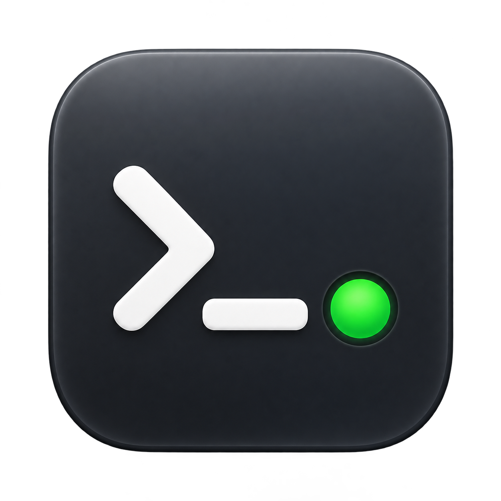

<p align="center">
  
</p>

# DevWatch

**Focus on your code. Your development processes start automatically.**

DevWatch is a free, open-source macOS menu bar app. It watches your local web projects and starts the appropriate development command, such as `bun run dev`, when relevant files change. Keep track of running scripts, process status, and logs directly in the app.

Built for workflows with Laravel, Vite, and AI coding assistants: it makes no difference whether you or an agent edits a file. DevWatch complements tools such as Laravel Herd without requiring an integration with a particular editor or agent.

**[Download DevWatch 1.0.0](https://github.com/twdnhfr/devwatch/releases/download/v1.0.0/DevWatch-1.0.0.dmg)** · [All releases](https://github.com/twdnhfr/devwatch/releases) · [Report an issue](https://github.com/twdnhfr/devwatch/issues)

macOS 14 or later · Apple Silicon and Intel · MIT license

## Installation

1. Download and open the DMG.
2. Drag **DevWatch** into **Applications** and launch it.
3. Open the project window from the menu bar icon and add a project folder.

Development tools such as Bun or Node.js and your project dependencies must already be installed. DevWatch does not install them for you.

The app interface is currently in German. The instructions below include the corresponding button labels where helpful.

## Features

- **Start on file changes:** Automatically runs the detected `dev` script, or `build` as a fallback. Further changes do not start a second instance of an already running process.
- **Discover projects:** Scans selected root folders for Git repositories and worktrees with a suitable `package.json` script. You can also add individual web projects directly.
- **Bun, npm, Yarn, and pnpm:** Detects the package manager from `packageManager` and lockfiles. The executable name or path can be customized.
- **Scripts in your menu bar:** Manually start and stop other scripts from `package.json`, such as `lint` or `test`, independently of the default command.
- **Multiple projects at once:** A compact project overview with process status, script results, and live logs.
- **Stop after 30 minutes of inactivity:** Stops the default process when no relevant files have changed. With autostart enabled, the next change starts it again.
- **Per-project controls:** Start, stop, pause autostart, and hide projects. Explicit pauses persist across app restarts.
- **Launch at login and update notices:** Optionally start with macOS and receive notifications about new GitHub releases.

## Getting started

1. Use **“Ordner hinzufügen …”** (Add folder) to select a folder such as `~/gits`. DevWatch discovers suitable projects recursively and rescans root folders regularly.
2. Check the detected command. Settings and process output are available under **“Details & Logs”**.
3. Edit a source file: with autostart enabled, the development command starts automatically. You can also use **“Starten”** (Start) to run it manually.
4. Use **“Stoppen”** (Stop) to end the process and pause autostart. Turn autostart back on when you want to resume.

**Autostart is enabled by default for newly discovered, valid projects.** Adding a project does not immediately start a process; the next relevant file change runs the detected command. Review scripts in unfamiliar repositories before adding them to a watched root folder. Changes to the command or `package.json` require renewed approval.

Closing the window leaves DevWatch running in the menu bar. Quitting the app normally stops the processes it started, including child processes within their process groups.

## Which changes trigger a start?

DevWatch responds to changes in source code and project configuration, including PHP and Blade files. Exclusions include:

- Git metadata and dependencies: `.git`, `node_modules`, `vendor`
- Runtime data and caches: for example, `storage` and `bootstrap/cache`
- Generated assets: for example, `public/build` and `dist`
- Runtime markers such as `public/hot`, along with temporary editor and system files

The initial scan of a folder does not trigger a start. A `git pull` or branch switch can change relevant files and therefore start a process.

The inactivity timer only tracks relevant file changes. Reading code in an editor or terminal, or using the website in a browser, does not extend the 30-minute period.

## Local data and updates

Project management and file watching run locally and require no account. Projects, root folders, and hidden paths are stored in `~/Library/Application Support/DevWatch/`. Logs stay in memory. Removing a project from the app does not delete its files.

For update notices, DevWatch checks the GitHub API for the latest release at launch and once a day thereafter. The notice opens the release page; downloads and installation are manual. Failed checks do not display an error. Project scripts launched by DevWatch may make their own network connections independently.

## Known limitations

- The automatic default command is `run dev`, or `run build` as a fallback. Other scripts are started manually. A successful build remains approved for the next change; a failure pauses autostart.
- A running process does not confirm that a website is reachable. There is no readiness check or automatic URL detection.
- Servers started outside DevWatch are neither detected nor taken over. Port conflicts appear in the tool's output.
- DevWatch supplements its executable search path with the login shell's path and common tool locations. Project-specific Node versions specified in `.nvmrc` are not selected automatically. You can set an absolute executable path if needed.
- Symlinked subdirectories are skipped during project discovery; targets outside the project folder are not watched. Moved or removed project roots and lost file events require review and renewed approval.
- Normal process cleanup does not cover deliberately daemonized processes that leave their process group, or force-quitting DevWatch.

## Development

DevWatch uses Swift, SwiftUI, and FSEvents. The project uses Swift Package Manager with no external package dependencies. Building requires macOS 14 or later and a Swift 6 toolchain; sources compile in Swift 5 language mode.

```sh
git clone https://github.com/twdnhfr/devwatch.git
cd devwatch
swift run DevWatch
swift test
```

Alternatively, open `Package.swift` in Xcode. See the **[build and release guide](docs/RELEASE.md)** for app bundles, DMGs, signing, notarization, and publishing.

For forks, point `DWReleaseFeedURL` in `Support/Info.plist` to your own repository, or remove the key to disable update checks.

## Contributing

Bug reports and suggestions are welcome through [GitHub Issues](https://github.com/twdnhfr/devwatch/issues), as are pull requests. When reporting a bug, include your macOS version, package manager, steps to reproduce, and relevant log excerpts without confidential information.

## License

DevWatch is open source under the [MIT license](LICENSE).
